# House Price Forecast

## Overview
This project explores various machine learning methods to predict house prices using the Ames Housing dataset. It covers feature selection, model training, evaluation, and comparison of regression algorithms.

## Table of Contents
- [Overview](#overview)
- [Features](#features)
- [Installation](#installation)
- [Usage](#usage)
- [Requirements](#requirements)
- [Results](#results)
- [Plots](#plots)
- [Method Comparison](#method-comparison)
- [Contact](#contact)

## Features
- Feature selection and data preview
- Linear Regression, SVR, Decision Tree, and Random Forest models
- Model evaluation using Mean Squared Error (MSE)
- Visualizations for feature relationships and model predictions

## Installation
1. Clone this repository:
    ```sh
    git clone https://github.com/yourusername/house-price-forecast.git
    cd house-price-forecast
    ```
2. Install dependencies:
    ```sh
    pip install -r requirements.txt
    ```

## Usage
Run the main analysis script:
```sh
python main.py
```
Generated plots and results will be saved in the `plots/` directory.

## Requirements
- Python 3.8+
- pandas
- scikit-learn
- matplotlib
- numpy

Install all requirements using:
```sh
pip install -r requirements.txt
```


# Results
--------
## Problem 1 - Feature Selection
Selected features: GrLivArea, YearBuilt, SalePrice

Preview of first 10 rows:

|   GrLivArea |   YearBuilt |   SalePrice |
|------------:|------------:|------------:|
|        1710 |        2003 |      208500 |
|        1262 |        1976 |      181500 |
|        1786 |        2001 |      223500 |
|        1717 |        1915 |      140000 |
|        2198 |        2000 |      250000 |
|        1362 |        1993 |      143000 |
|        1694 |        2004 |      307000 |
|        2090 |        1973 |      200000 |
|        1774 |        1931 |      129900 |
|        1077 |        1939 |      118000 |

--------

## Problem 2: - Linear Regression
Mean Squared Error (MSE): 2495554898.67

**GrLivArea vs SalePrice:**  
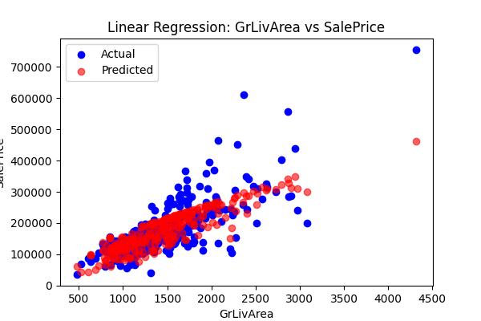

**YearBuilt vs SalePrice:**  
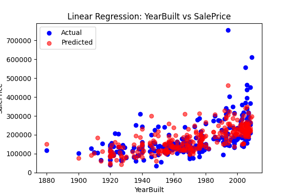

**Linear Regression - GrLivArea vs SalePrice:**  


**Linear Regression - YearBuilt vs SalePrice:**  


**SVR - GrLivArea vs SalePrice:**  


**SVR - YearBuilt vs SalePrice:**  
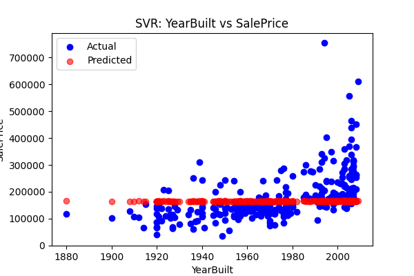

**Decision Tree - GrLivArea vs SalePrice:**  
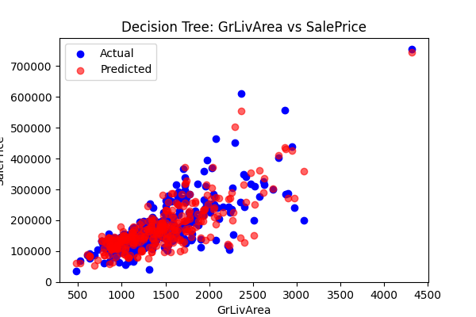

**Decision Tree - YearBuilt vs SalePrice:**  


**Random Forest - GrLivArea vs SalePrice:**  
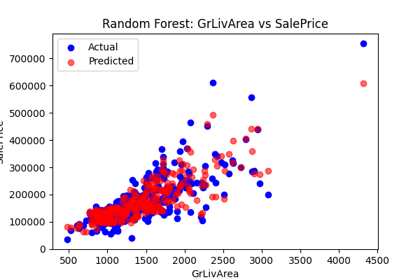

**Random Forest - YearBuilt vs SalePrice:**  


### Problem 3: Method Comparison
| Method | MSE |
|--------|------|
| Linear Regression | 2495554898.67 |
| SVR | 7844111028.86 |
| Decision Tree | 2184045784.67 |
| Random Forest | 1546711974.03 |

**Linear Regression - GrLivArea vs SalePrice:**  
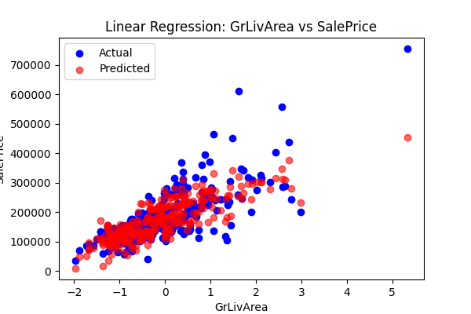

**Linear Regression - YearBuilt vs SalePrice:**  
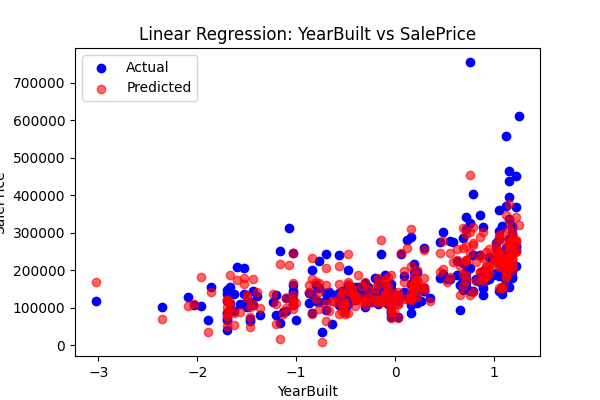

**Linear Regression - OverallQual vs SalePrice:**  
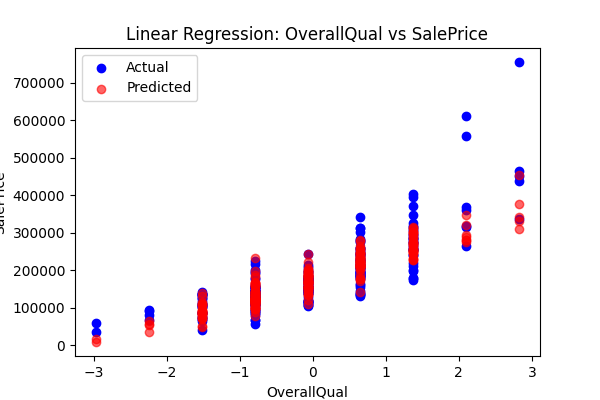

**Linear Regression - TotRmsAbvGrd vs SalePrice:**  
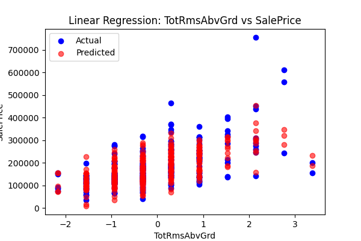

**Linear Regression - LotArea vs SalePrice:**  
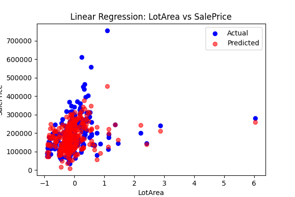

**SVR - GrLivArea vs SalePrice:**  
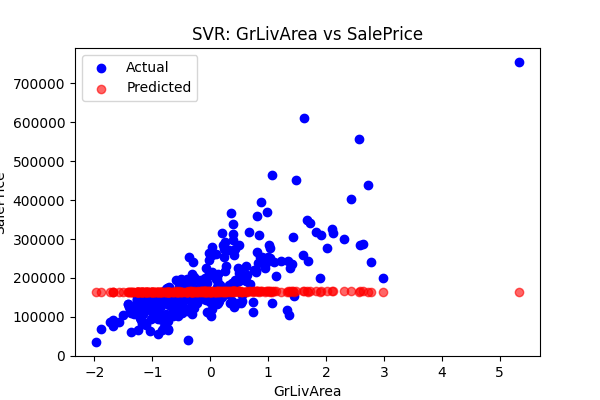

**SVR - YearBuilt vs SalePrice:**  
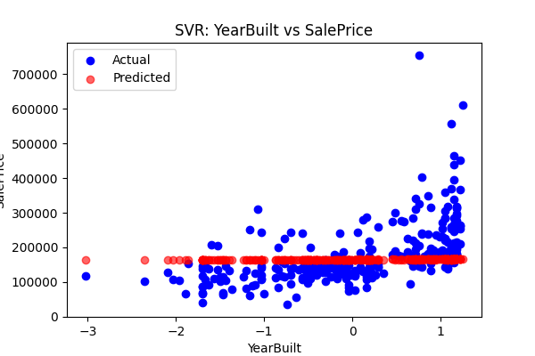

**SVR - OverallQual vs SalePrice:**  
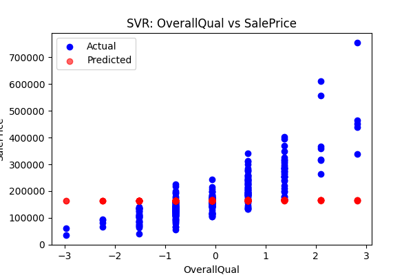

**SVR - TotRmsAbvGrd vs SalePrice:**  
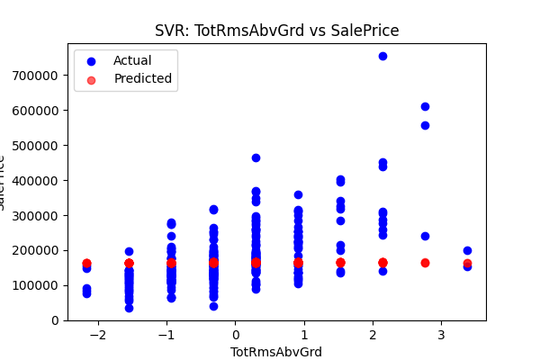

**SVR - LotArea vs SalePrice:**  
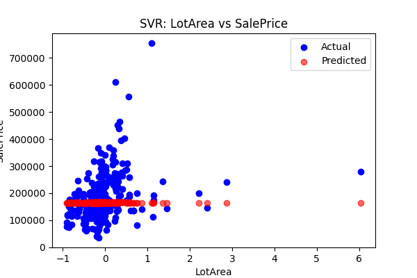

**Decision Tree - GrLivArea vs SalePrice:**  
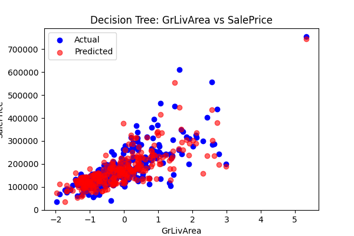

**Decision Tree - YearBuilt vs SalePrice:**  
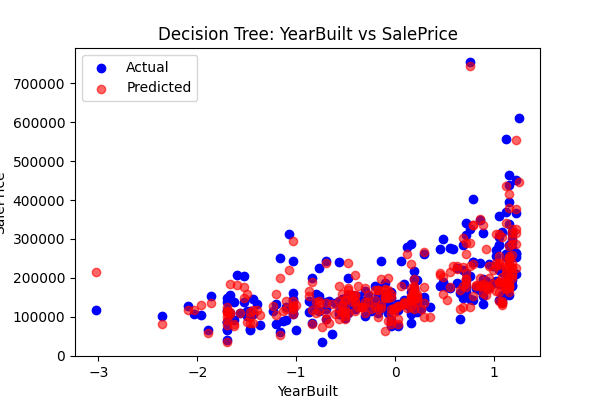

**Decision Tree - OverallQual vs SalePrice:**  
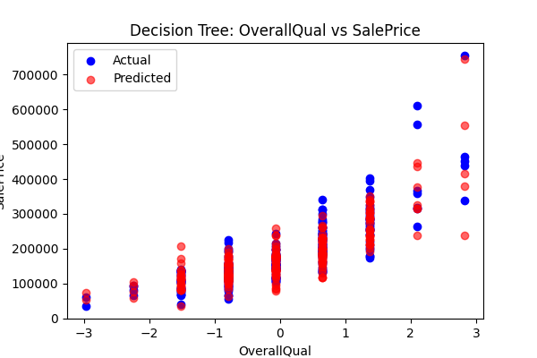

**Decision Tree - TotRmsAbvGrd vs SalePrice:**  
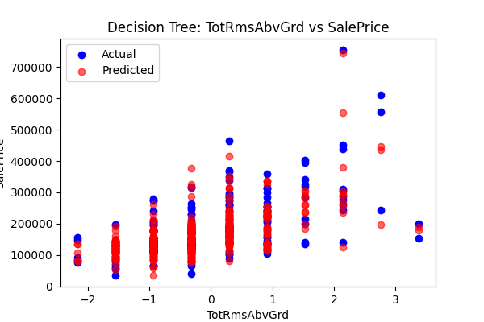

**Decision Tree - LotArea vs SalePrice:**  
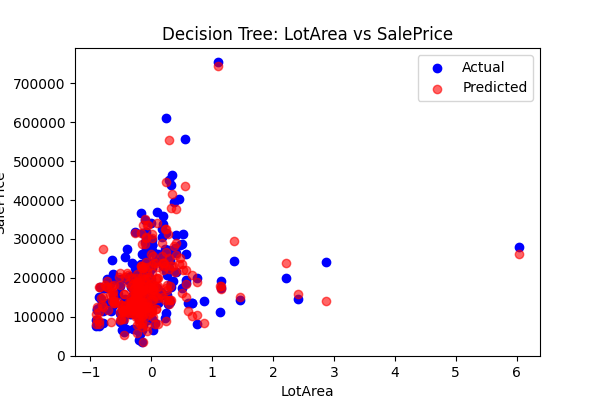

**Random Forest - GrLivArea vs SalePrice:**  
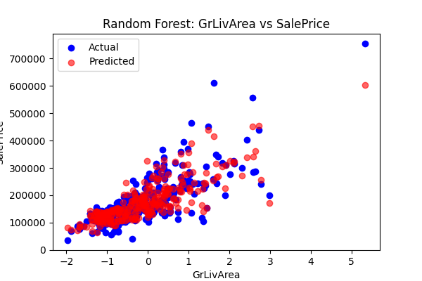

**Random Forest - YearBuilt vs SalePrice:**  


**Random Forest - OverallQual vs SalePrice:**  
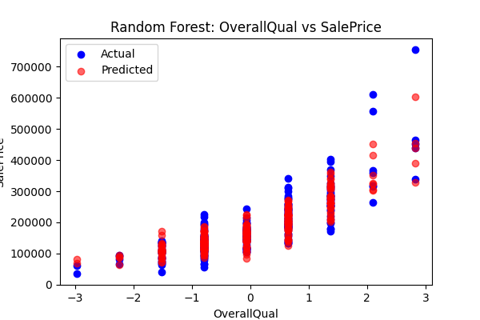

**Random Forest - TotRmsAbvGrd vs SalePrice:**  
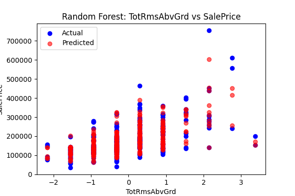

**Random Forest - LotArea vs SalePrice:**  
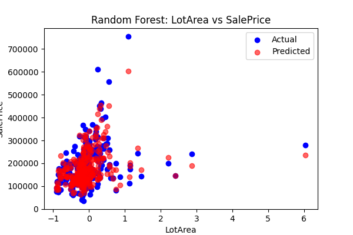


### Problem 4 - Additional Features
| Method | MSE |
|--------|------|
| Linear Regression | 1794764677.13 |
| SVR | 7843780421.26 |
| Decision Tree | 1602910649.85 |
| Random Forest | 1019691467.15 |

Comment: Adding more features generally improves model performance, and tree-based models can help identify feature importance.


----


## Author

**Assignment:** House Price Forecast

**Name:** Victor Karisa

**Date:** 03/10/2025